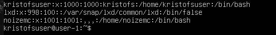
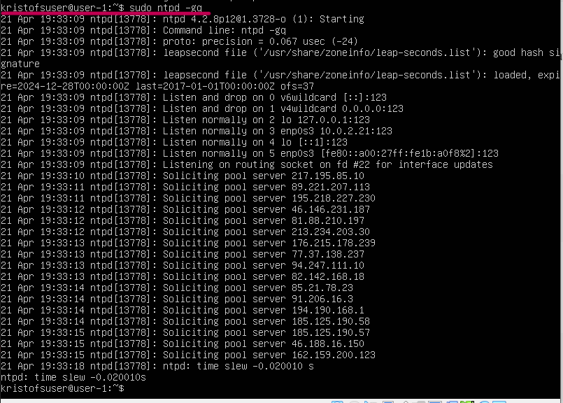
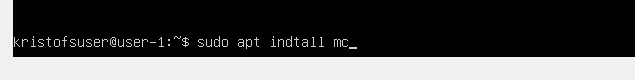
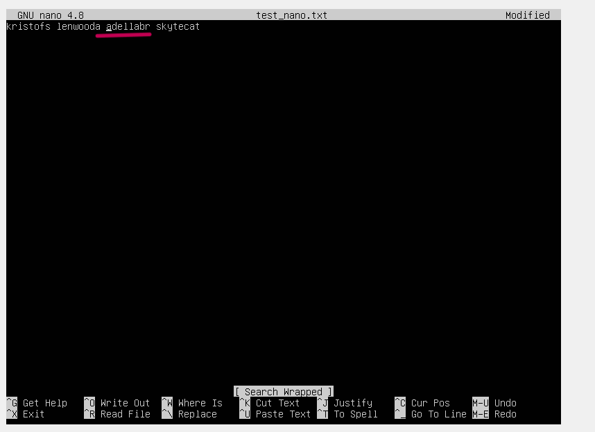
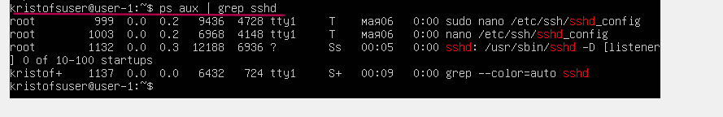
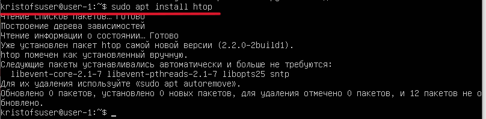
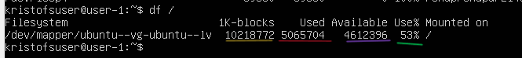
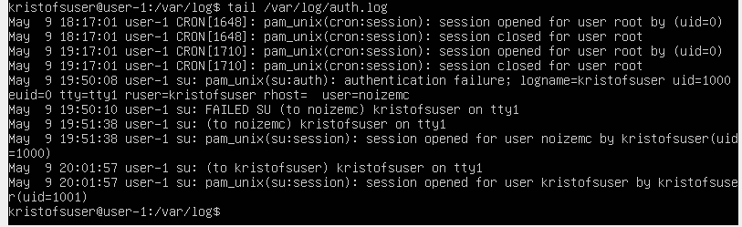
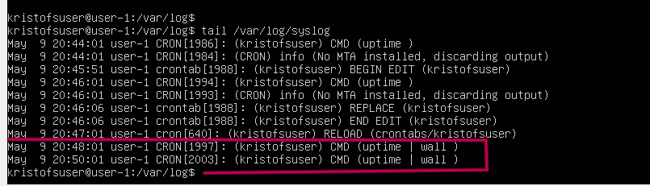

# Операционные системы UNIX/Linux (Базовый).

Установка и обновления системы Linux. Основы администрирования.

### Администрирование

`-` Администрирование - это, если не вдаваться в подробности, поддержка и улучшение работы всего компьютерного и офисного оборудования, периферийных устройств, сетевого подключения и т.д. При администрировании Linux большая часть работы протекает в терминале, поэтому стоит начать с использования базовых утилит.

### Виртуальные машины

`-` Виртуальная машина (VM, ВМ) также, как и физические компьютеры, имеет ЦП, память, диски для хранения файлов и при необходимости может подключаться к Интернету. Отличие лишь в том, что компоненты вашего компьютера (аппаратная часть) материальны, а виртуальные машины существуют только в виде кода.

`-` Проще говоря, это виртуальный компьютер, на который можно устанавливать операционную систему и все сопутствующее программное обеспечение, при этом никаких изменений в Вашей основной операционной системе не будет.

`-` Виртуализация — это процесс создания программной (виртуальной) версии компьютера с выделенными ресурсами ЦП, памяти и хранилища, которые "заимствуются" у физического компьютера. Виртуальная машина — это компьютерный файл (образ), который действует как обычный компьютер.

`-` В свою очередь _VirtualBox_ - это программный продукт виртуализации, т.е. инструмент для создания виртуальных машин.

## Part 1. Установка ОС

- Узнайте версию Ubuntu, выполнив команду \
`cat /etc/issue.`

Установила версию Ubuntu, проверяю в терминале: 

## Part 2. Создание пользователя

- Создаю пользователя noizemc через команду `sudo adduser noizemc`

- Добавляю пользователя в группу adm через команду `sudo usermod -a -G adm noizemc`

- Проверяю нахождение пользователя в группе adm через команду `groups noizemc`

- Вывожу команду `cat /etc/passwd`

## Part 3. Настройка сети ОС
Задание 3.1
##### Задать название машины вида user-1  
- Вывожу мое старое имя 

- Задаю название машины вида user-1 через редакцию файла `/etc/hostname` и файл `/etc/hosts` через команды `sudo nano /etc/hostname`

- Делаю reboot машины чтобы обновить имя

- Новое имя машины

Задание 3.2
##### Установить временную зону, соответствующую вашему текущему местоположению.  

- Открываю лист со всеми временными зонами через команду `timedatectl list-timezones`

- Устанавливаю временную зону через команду:`timedatectl set-timezone Europe/Moscow`

- Проверяю как установлена временная зона через команду `timedatectl`

Задание 3.3
##### Вывести названия сетевых интерфейсов с помощью консольной команды.
Сетевой интерфейс (сетевой адаптер) — это часть аппаратного устройства, которая позволяет операционным системам и программам передавать данные через компьютерную сеть. Сетевой интерфейс является частью сетевой карты, маршрутизатора, коммутатора и других устройств.

- Вывожу названия сетевых интерфейсов с помощью консольной команды `ip -br link show`

- Объяснение наличия интерфейса lo

lo (loopback device) – виртуальный интерфейс, присутствующий по умолчанию в любом Linux. Он используется для отладки сетевых программ и запуска серверных приложений на локальной машине. У него есть dns-имя – localhost. Посмотреть привязку можно в файле /etc/hosts. 

lo ― локальная петля. Служит для подключения по сети к этому же компьютеру и не требует дополнительной настройки; enp0s3 ― сетевой адаптер Ethernet.

Интерфейс lo обычно имеет IP-адрес 127.0.0.1 и позволяет программам на компьютере обращаться к себе через сетевой стек, что удобно для тестирования и отладки программ, а также для обмена данными между различными процессами на вашем компьютере.

Задание 3.4
##### Используя консольную команду получить ip адрес устройства, на котором вы работаете, от DHCP сервера.

- Вывожу ip моего компьютера спомощью команды `hostname -I`

- Расшифровка DHCP:
Dynamic Host Configuration Protocol (DHCP) — это сетевой протокол, который позволяет автоматически назначать подключаемым к сети устройствам IP-адреса и другие параметры конфигурации. Он упрощает управление и снижает вероятность конфликтов — назначения двум устройствам одного и того же адреса. IP-адрес можно назначать вручную каждому клиенту, то есть компьютеру в локальной сети.

Задание 3.5
##### Определить и вывести на экран внешний ip-адрес шлюза (ip) и внутренний IP-адрес шлюза, он же ip-адрес по умолчанию (gw). 

- Вывожу внутренний и внешний ip шлюза через команду `ip route | grep default`
- Внутренний по умолчанию (gw): 10.0.2.2
- Внешний (ip): 10.0.2.15
(больше обрезать не получилось, см нижний вариант в скрине)

Задание 3.6
##### Задать статичные (заданные вручную, а не полученные от DHCP сервера) настройки ip, gw, dns (использовать публичный DNS серверы, например 1.1.1.1 или 8.8.8.8).
- открываю файл с расширением .yaml

- Редактирую и устанавливаю настройки 

-gw: 10.0.2.2
-dns: [1.1.1.1, 8.8.8.8]
-ip[10.0.2.21/24]

- Сохраняю и принимаю изменения сетевых настроек через команду sudo netplan apply

Задание 3.7
##### Перезагрузить виртуальную машину. Убедиться, что статичные сетевые настройки (ip, gw, dns) соответствуют заданным в предыдущем пункте.  

- Перезапускаю виртуальную машину

- Убеждаюсь через команду ifconfig, что сетевые настройки сохранились после ребута:

Задание 3.7
- Пингую удаленные хосты 1.1.1.1 и ya.ru

## Part 4. Обновление ОС

Задание 4.1
##### Обновить системные пакеты до последней на момент выполнения задания версии.  
- Обновляю системные пакеты до последней версии через команду `sudo apt update`

Задание 4.2
- Ввожу команду повторно чтобы убедиться что обновление прошло успешно

## Part 5. Использование команды **sudo**
Задание 5.1
##### Разрешить пользователю, созданному в [Part 2], выполнять команду sudo.

- Создаю папку для передачи прав sudo через команду  `sudo touch`

- Даю пользователю noizemc права пользователя sudo через команду usermod -a -G sudo noizemc

- Проверяю может ли пользователь использовать команду sudo

Задание 5.2
- Значение команды sudo:
Исторически первой была команда su.

su (сокр. от Substitute User, Set UID, Switch User, Super User — замена пользователя, переключение пользователя, суперпользователь) — команда, позволяющая пользователю войти в систему под другим именем, не завершая текущий сеанс. Обычно используется для временного входа суперпользователем для выполнения административных работ. Запущенная без параметров, она запрашивает пароль суперпользователя, и в случае успеха просто подменяет текущее имя пользователя на root, оставляя почти все переменные окружения от старого пользователя (кроме PATH, USER и еще пары-тройки). 

sudo (substitute user and do, дословно «подменить пользователя и выполнить») — программа для системного администрирования UNIX-систем, позволяющая делегировать те или иные привилегированные ресурсы пользователям с ведением протокола работы.
Программа sudo настраивается через файл /etc/sudoers.

В Debian-based-дистрибутивах пользователь root не имеет пароля, вместо этого все административные действия должны производиться через sudo.

При использовании sudo пользователь вводит свой пароль, а не пароль root'а.
По умолчанию sudo записывает всю пользовательскую активность в лог.
в sudo администратор системы может ограничить команды, выполняемые пользователями.
Если пользователь должен быть лишен права администрирования, в случае с su он должен забыть пароль root'а; если используется sudo, достаточно вынести его из соответствующей группы.
sudo может запоминать факт правильно введённого пароля и не спрашивать в дальнейшем. В Ubuntu пароль запоминается на 15 минут. Это тоже можно настроить. Программа sudo хранит свои служебные данные в каталоге /var/run/sudo/.

Задание 5.3
- Поменять hostname ОС от имени пользователя, созданного в пункте [Part 2](#part-2-создание-пользователя) (используя sudo).
- Через команду  `sudo nano /etc/hostname` редактирую файл названия виртуальной машины
- Делаю ребут 
- Новое название

## Part 6. Установка и настройка службы времени

Задание 6.1
##### Настроить службу автоматической синхронизации времени.  

- Вывожу время часового пояса, в котором нахожусь через команду `date`

- Устанавливаю ntpd через команду `sudo apt install -y ntp`

- Обовляю машину через update

- Смотрю все списки времени, к которым подключена машина, через команду
`ntpq -p`

- Останавливаю ntp демона через команду `sudo systemctl stop ntp`

- Принудительно синхронизирую время через команду `sudo ntpd -gq`

- Запускаю ntp через команду `sudo systemctl start ntp`
- Проверяю статус через команду `sudo systemctl status ntp`

- Вывожу команду `timedatectl` для проверки

## Part 7. Установка и использование текстовых редакторов

Задание 7.1
##### Установить текстовые редакторы **VIM** (+ любые два по желанию **NANO**, **MCEDIT**, **JOE** и т.д.)

- Устанавливаю vim через команду  `sudo apt install vim`

- Устанавливаю mcedit через команду `sudo apt install mcedit`

Задание 7.2
##### Используя каждый из трех выбранных редакторов, создайте файл *test_X.txt*, где X -- название редактора, в котором создан файл. Напишите в нём свой никнейм, закройте файл с сохранением изменений. 

- Создаю текстовый документ в vim test_vim.txt, где пишу свой никнейм. Для сохранения использую комбинацию клавиш: `:wq`

- Создаю текстовый документ в mcedit test_mcedit.txt, где пишу свой никнейм. Для сохранения использую комбинацию клавиш: `F2`

- Создаю текстовый документ в nano test_nano.txt, где пишу свой никнейм. Для сохранения использую комбинацию клавиш: `Ctrl + O`

Задание 7.3
##### Используя каждый из трех выбранных редакторов, откройте файл на редактирование, отредактируйте файл, заменив никнейм на строку "21 School 21", закройте файл без сохранения изменений.

- Редактирую текстовый документ в vim test_vim.txt, заменяю на "21 School 21". Для выхода БЕЗ сохранения использую комбинацию клавиш: `:q`

- Создаю текстовый документ в mcedit test_mcedit.txt, заменяю на "21 School 21". Для выхода БЕЗ сохранения использую комбинацию клавиш: `F10`

- Создаю текстовый документ в nano test_nano.txt, заменяю на "21 School 21". Для выхода БЕЗ сохранения использую комбинацию клавиш: `Ctrl + X`

Задание 7.4
##### Используя каждый из трех выбранных редакторов, отредактируйте файл ещё раз (по аналогии с предыдущим пунктом), а затем освойте функции поиска по содержимому файла (слово) и замены слова на любое другое.

Поиск по содержимому: 

- Поиск по слову в vim производится через символ  `/`, открывается строка где можно написать искомое слово, после этого следует нажать `Enter` и курсор передвинется на искомое слово

- Поиск по слову в mcedit производится через клавишу `F7`, после чего открывается окно где можно выбрать слово или строку для поиска и указать параметры, по которым будет проводиться поиск

- Поиск по слову в nano производится через клавишу `Ctrl + W` для поиска начиная от курсора к концу файла, `Ctrl + Q` для поиска начиная от курсора к началу файла, после чего появляется строка, где можно написать искомое слово

Замена слова на любое другое:

- Замена слова в vim происходит через комбинацию клавиш `:s/старое/новое`

- Замена слова в mcedit происходит через клавишу `F4`

- Замена слова в nano происходит через комбинацию клавиш `Ctrl+\`
После чего введите строку, которую необходимо искать и нажмите клавишу Enter. Затем введите строку, на которую произвести замену и нажмите Enter.

## Part 8. Установка и базовая настройка сервиса **SSHD**
Задание 8.1
##### Установить службу SSHd.  
- Устанавливаю службу SSHd через команду `sudo apt-get install ssh`

Задание 8.2
##### Добавить автостарт службы при загрузке системы.  
- Добавляю автостарт службы при загрузке системы через команду `sudo systemctl enable ssh`

- Проверяю активен ли автостарт для sshd через команду  `sudo systemctl status ssh`

Задание 8.3
##### Перенастроить службу SSHd на порт 2022.  
- Перенастраиваю через редакци файла в nano

- Перезапускаю

- Проверяю через `sudo netstat -tupln | grep ssh`

Задание 8.4
##### Используя команду ps, показать наличие процесса sshd. Для этого к команде нужно подобрать ключи.
- Использую команду `ps aux | grep sshd` для вывода процесса sshd.

Команда ps (Process Status) используется для вывода информации о текущих процессах, запущенных на компьютере. Параметры aux команды ps используются для вывода списка всех процессов на компьютере, процессы всех пользователей и вывод всей подробной информации о каждом процессе.
"pc aux grep" часто используется для поиска конкретного процесса или информации о процессах с помощью фильтрации вывода команды ps aux.

- Перезагружаю машину и использую команду `netstat -tan`

Команда netstat -tan используется для вывода сетевой статистики и информации о сетевых соединениях.
Команда netstat предоставляет информацию о сети, сетевых интерфейсах и сетевых соединениях на компьютере.
-tan :
  t: Параметр t  отображает только TCP-соединения.
  a: Параметр a указывает на вывод всех активных соединений, включая прослушивающие порты.
  n: Параметр n используется для отображения числовых значений IP-адресов и портов вместо их имен.
Команда netstat -tan выводит информацию о всех активных TCP-соединениях на компьютере, отображая числовые значения IP-адресов и портов.

- Значение 0000 в столбце "Foreign Address" указывает на то, что соединение находится в режиме ожидания входящего подключения от любого удаленного адреса.

## Part 9. Установка и использование утилит **top**, **htop**
Задание 9.1
##### Установить и запустить утилиты top и htop.  
- утилита top была установлена по умолчанию, устанавливаю утилиту htop

##### uptime: 32 min
##### количество авторизованных пользователей: 1 user
##### загрузка cpu: выделено зеленым
##### загрузка памяти: выделено синим

-Через функцию Filter (F4)  в htop нахожу:
  - pid процесса занимающего больше всего памяти

  

  - pid процесса, занимающего больше всего процессорного времени

- В отчёт вставить скрин с выводом команды htop:
  - отсортированному по PID, PERCENT_CPU, PERCENT_MEM, TIME
  PID:

  

  PERCENT_CPU (через F6):

  

  TIME:
  - Сортировка по времени

  
  
  - Через клавишу F3 фильтрую для отображения процесса sshd (выделено желтым)

  

  - Через поиск (f3) нахожу процесс syslog (выделено желтым)

  

  - Через setup (f2) добавляю hostname, clock и uptime

  

## Part 10. Использование утилиты **fdisk**
Задание 10.1

- Запускаю команду `fdisk -l`
Название диска: выделено желтым
Размер: выделено фиолетовым
Количество секторов: выделено красным

Размер swap: определяю через команду `swapon -s`

Файл подкачки (swap) представляет собой специальное пространство на жестком диске, которое используется операционной системой в случае нехватки оперативной памяти (RAM). Когда оперативная память заполнена, операционная система начинает использовать файл подкачки для временного хранения данных, которые не помещаются в оперативную память.

## Part 11. Использование утилиты **df** 

Задание 11.1
- Запускаю команду `df /` для корневого раздела (/):
Выделено на скрине: 
##### размер раздела: желтый
##### размер занятого пространства: красный
##### размер свободного пространства: фиолетовый
##### процент использования: зеленый

##### Запустить команду df -Th.
- Для возможности чтения человеком вывожу через команду `df -Th /`. Единицы измерения: гигабайты

Выделено на скрине:
  размер раздела: желтый
  размер занятого пространства: красный
  размер свободного пространства: фиолетовый
  процент использования: зеленый

- Тип файловой системы: ext4 (выделено синим)

## Part 12. Использование утилиты **du**
Задание 12.1
- Запускаю команду `du`
- Запускаю команду `du -h` для читаемого вида

Задание 12.2 
Вывожу размеры папок /home, /var, /var/log (в байтах, в человекочитаемом виде)

Задание 12.3 
- Вывожу размер всего содержимого в /var/log (не общее, а каждого вложенного элемента, используя *)

## Part 13. Установка и использование утилиты **ncdu**
Задание 13.1 
- Устанавливаю утилиту ncdu через команду `sudo apt install ncdu`

- Вывожу размер папок /home, /var, /var/log
home:

/var:

/var/log:

## Part 14. Работа с системными журналами
Задание 14.1
- Открываю папку чтобы посмотреть что там есть dmesg

- Открываю syslog

- Открываю auth log

 
- Время последней авторизации: (на скрине)

- Перезапускаю службу SSHd.

- Показываю историю в логах

## Part 15. Использование планировщика заданий **CRON**

Задание 15.1
- Вызываю `crontab -l` через nano
- Пишу задание о выводе времени

Задание 15.2
- Запуск команды uptime через 2 минуты

- Текущие задания 

- Вставить в отчёт скрины со строчками о выполнении и списком текущих задач.

- Удалила все задачи для CRON

